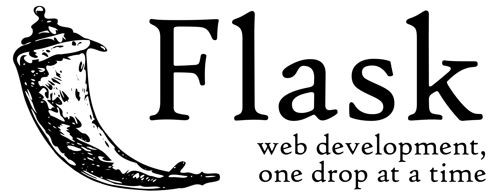

# Lesson 2: Flask Quick Start

In this second session, we'll dive into Flask, a powerful Python web framework...

## Welcome

Slides: `npm run day2`

## Flask



### What?

Flask is a microframework written in Python.

### Why?

Why Flask over other Python web frameworks like Django?

1. Flask is considered more Pythonic than Django since, in most cases, it's more explicit. It's also much lighter than Django so you can quickly get an app up and running.
1. It scales well.
1. Strong community.
1. You can learn A LOT from just reading the source code since it's so well documented.
1. It's perfect for microservices and RESTful APIs.

## Quick Start

Create a project directory:

```sh
$ mkdir flask-hello-world
$ cd flask-hello-world
```

Create and activate a virtualenv:

```sh
$ python3.6 -m venv env
$ source env/bin/activate
```

Install Flask v[0.12](https://pypi.python.org/pypi/Flask/0.12):

```sh
(env)$ pip install Flask==0.12
(env)$ pip freeze > requirements.txt
```

Add an *app.py* file:

```python
from flask import Flask

app = Flask(__name__)

@app.route('/')
def index():
    return 'Hello, World!'

if __name__ == '__main__':
    app.run(debug=True)
```

Run:

```sh
(env)$ python app.py
* Running on http://127.0.0.1:5000/ (Press CTRL+C to quit)
* Restarting with stat
* Debugger is active!
* Debugger pin code: 292-049-281
```

Navigate to [http://localhost:5000/](http://localhost:5000/) in your browser, and you should see `Hello, World!` staring back at you.

### What's happening?

Review *Flask: Quick Start* in **Real Python Course 2**.

## Flask Calculator

Let's build a basic calculator together...

1. Create a new project.
1. Before you write any code, make sure everything is wired up correctly and get a sanity check. Why is this important?
1. Set up the following four routes:
  - `/calc/add/:num1/:num2`
  - `/calc/sub/:num1/:num2`
  - `/calc/mult/:num1/:num2`
  - `/calc/div/:num1/:num2`
1. Respond with JSON:

  ```json
  {
    "operator": "add",
    "num1": "9",
    "num2": "4",
    "solution": "27"
  }
  ```

## Templating

Foo

## SQL

Foo

## Homework

1. Complete the [Rendering Bokeh Plots in Flask](https://github.com/rpazyaquian/bokeh-flask-tutorial/wiki/Rendering-Bokeh-plots-in-Flask) tutorial, taking note of any questions you may have
